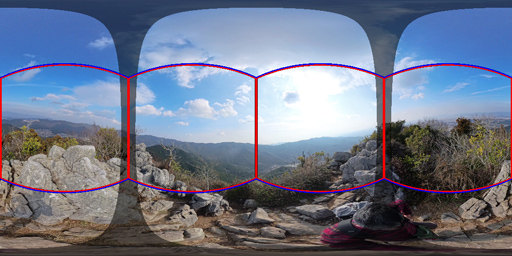
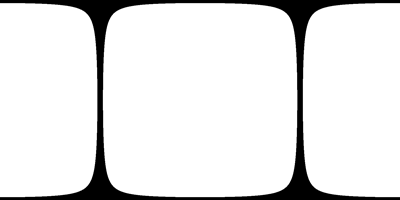
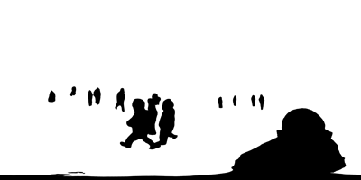

# tetraface-3dgs-utils

3Dガウシアンスプラッティング(3DGS)用のワークフローとして自作しながら使っているスクリプト集です。

## 必要項目

以下のソフト・モジュールをインストールしてください。すべてのスクリプトで共通です。

- [CUDA Toolkit 12.8](https://developer.nvidia.com/cuda-12-8-0-download-archive) (他のバージョンは不可)
- [Python 3.x](https://www.python.org/) (3.11.8で確認)
- [metashape_360_lfs.py (フォーク版)](https://github.com/tetraface/metashape_360_lfs) 

### 依存pythonモジュール

- NumPy
- OpenCV
- Pillow
- Open3D (metashape_360_lfs内で使用)
- PyTorch 2.8.0 (with CUDA 12.8)
- ultralytics
- tqdm

インストール例:
```
pip install torch==2.8.0 torchvision==0.23.0 torchaudio==2.8.0 --index-url https://download.pytorch.org/whl/cu128
pip install numpy opencv-python Pillow open3d ultralytics tqdm
```

## 各スクリプトの概要

### cubemap_transforms_json.py

Metashapeが出力する**360度画像用**xmlファイルからtransforms.jsonに変換したものを元に、さらにキューブマップ用に変換し、一般的な3DGSソフトで入力できるようにします。<br>
[→詳細を見る](doc/cubemap_transforms_json.ja.md)<br>


### stitch_mask.py

360度画像内の２つの魚眼画像の指定角度外にマスクを生成します。レンズ間のつなぎ目付近で被写体との距離が近くて、スチッティング領域が目立つ場合に有効です。<br>
[→詳細を見る](doc/stitch_mask.ja.md)<br>



### yolo_mask.py

360度画像内の人物を検知してマスクを生成します。<br>
[→詳細を見る](doc/yolo_mask.ja.md)<br>

