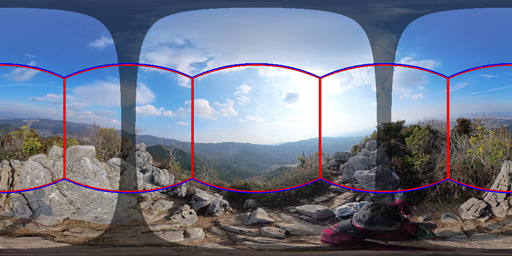
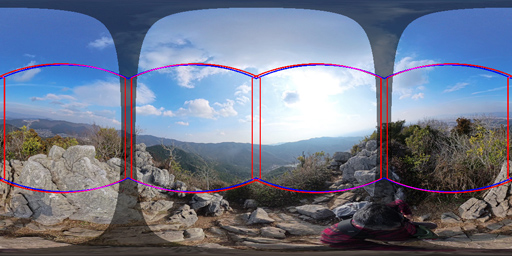

# cubemap_transforms_json.py : transforms.json converter from equirectangular to cubemap

This script converts `transforms.json` for **360° equirectangular image** by [metashape_360_lfs](https://github.com/tetraface/metashape_360_lfs) into **cubemap-based images**.

That is, the following conversions are possible:

Metashape (Standard/Professional) > xml/pointcloud > transforms.json > cubemap > 3DGS software ([Jawset Postshot](https://www.jawset.com/), [Brush](https://github.com/ArthurBrussee/brush), [LichtFeld Studio](https://github.com/MrNeRF/LichtFeld-Studio), etc...)

[JP 日本語の説明](cubemap_transforms_json.ja.md)

## Directory structure

### Input directory example

```
input_dir/
├─ metashape.xml
├─ metashape.ply
├─ transforms.json
├─ pointcloud.ply (optional)
├─ images/
│ ├─ image_000.jpg (or .png)
│ └─ image_001.jpg
│ └─ ...
└─ masks/ # (optional)
  ├─ image_000.png (or .jpg.png, .png.png)
  └─ image_001.png
  └─ ...
```

| File | Description |
|------|-------------|
|metashape.ply|Expoted in Metashape [File > Export > Export Point Cloud]|
|metashape.xml|Expoted in Metashape [File > Export > Export Cameras]|
|transforms.json|Converted by metashape_360_lfs|
|pointcloud.ply|Converted by metashape_360_lfs (optional)|

### Output directory example

```
output_dir/
├─ transforms.json
├─ images/
│ ├─ image_000_nx.jpg (or .png)
│ ├─ image_000_ny.jpg
│ ├─ image_000_nz.jpg
│ ├─ image_000_px.jpg
│ ├─ image_000_py.jpg
│ ├─ image_000_pz.jpg
│ ├─ image_001_nx.jpg
│ └─ ...
└─ masks/
  ├─ image_000_nx.png
  └─ ...
```


## Usage

### Basic usage

Convert transforms.json and images in the current directory: (also convert if masks directory exists)
```
python metashape_360_lfs.py --images images --xml metashape.xml --output .
python cubemap_transforms_json.py .
```

### Detailed

With specifying output directory:
```
python cubemap_transforms_json.py . ./cubic
```

With options:

```
python cubemap_transforms_json.py . ./cubic \
  --yaw 45 \
  --stitch 2.5 \
  --fov 90
```

Specifying `--yaw 45 --stitch DEGREE` will prevent the stitching area between two fisheye images from crossing the center of the cubemap image. These options are effective for Insta360 and OSMO 360 images **without any image correction** like camera tilt and stitching.

The following images illustrate how each face of the cubemap and the boundary between two fisheye images occupy a portion of the equirectangular image.

<br>
*--yaw 0*

<br>
*--yaw 45*

<br>
*--yaw 45 --stitch 2.5 --fov 91.5*

### For LichtFeld Studio

By default, coordinate axis transformation suitable for Postshot/Brush is performed. For Brush, specify `--brush`.

```
python metashape_360_lfs.py --images images --xml metashape.xml --output .
python cubemap_transforms_json.py . ./cubic --brush
```

For LichtFeld Studio, specify `--no_transform`.

```
python metashape_360_lfs.py --images images --xml metashape.xml \
  --ply metashape.ply --output .
python cubemap_transforms_json.py . ./cubic --no_tranform
```

### Options

|Option|Argument|Description|
|------|----|-----------|
|--json|filename|transforms.json with a different filename (default='transforms.json')|
|--mask_dir|directory name|Input mask images directory (default='./cubic')|
|--mask_from_alpha|(no)|Extract masks from alpha channel in images|
|--yaw|degrees|Shift the horizontal angle (default=45.0 degrees)|
|--stitch|degrees|Angle to avoid stitching areas (default=0.0 degrees)|
|--fov|degrees|Field of view for cubemap faces (default=90.0 degrees)|
|--no_bottom|(no)|Output without a bottom face of cube-map.|
|--no_top|(no)|Output without a top face of cube-map.|
|--no_image|(no)|Disable image conversion. Only transforms.json will be converted.|
|--no_transform|(no)|Disable coordinate axis conversion.|
|--brush|(no)|Convert coordinates for Brush.|
|--duplicate|(no)|Allow duplicated image files by merging chunks.|

## How to import into 3DGS software

Import the following files in each software:

### Postshot / Brush

- metashape.ply (exported in `Metashape`)
- transforms.json (in the output directory)
- images (in the output directory)
- masks (in the output directory: optional)

### LichtFeld Studio

- pointcloud.ply (converted by `metashape_360_lfs`)
- transforms.json (in the output directory)
- images (in the output directory)
- masks (in the output directory: optional)
